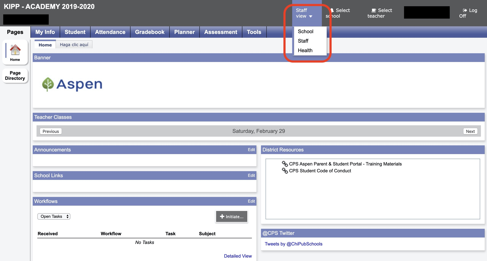
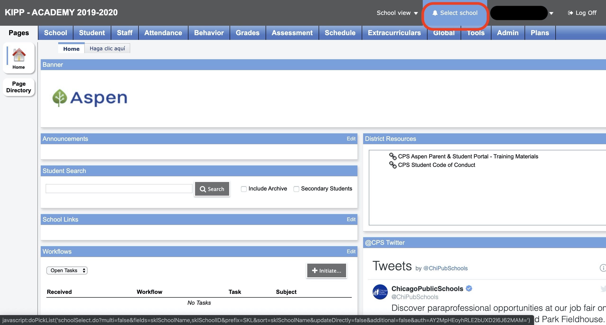
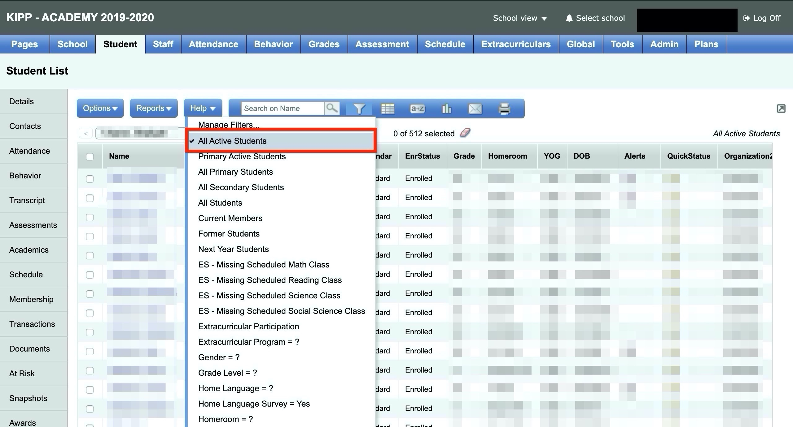
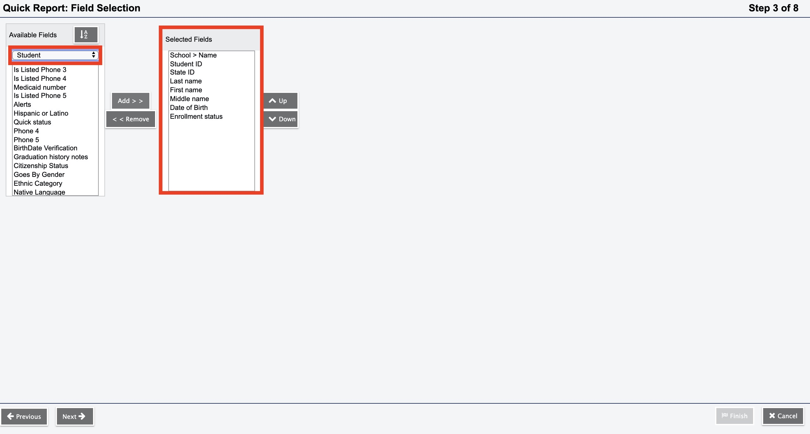
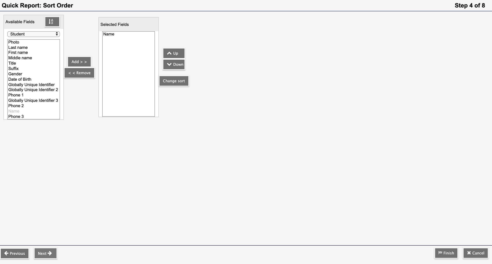
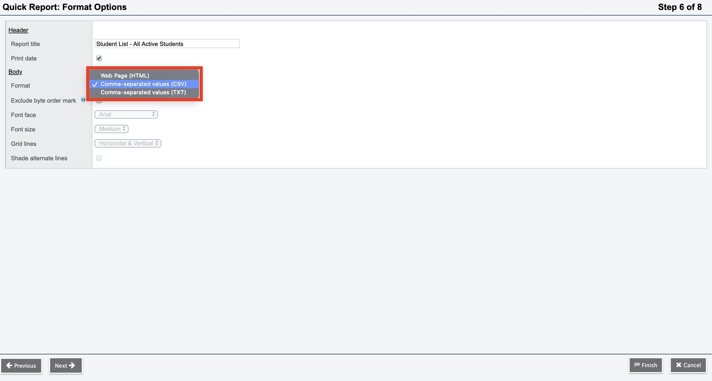
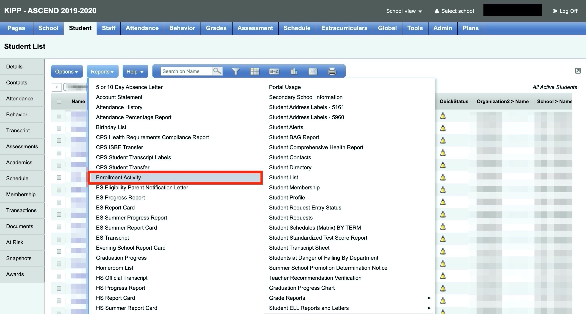
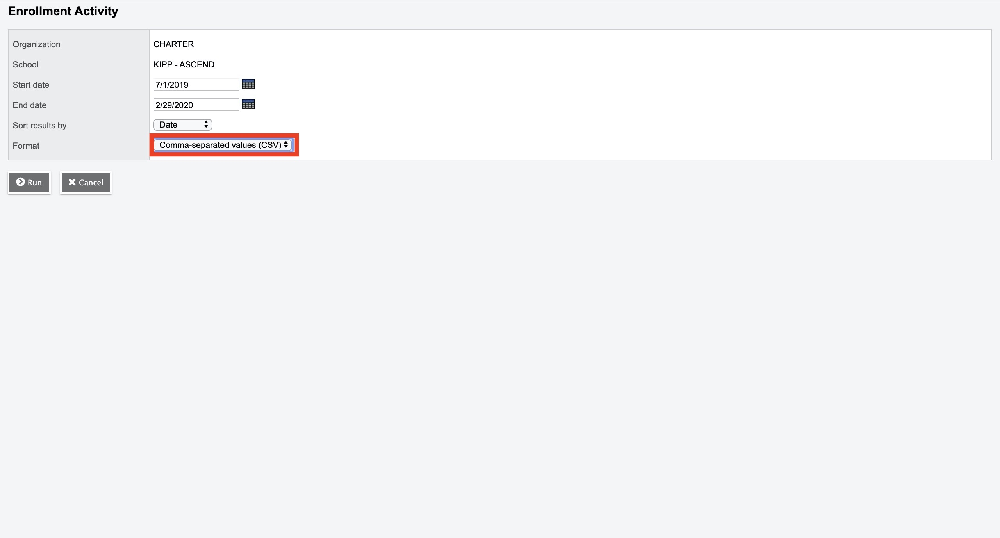

# 1. Introduction

In Illinois, at the at the end of every semester, each school is required to submit a set of data to the Office of I&I for transmission to the Illinois State Board of Education (ISBE). The state then uses this data to produce the annual State School Report Cards. The purpose of this project is to collect student and teacher data from KIPP Chicago's different data systems and put them in a format that conforms to ISBE's reporting requirements.

This document provides a detailed description of each data file and how to find it. The document also points out possible shortcomings and issues with 1) the code, and 2) the report submission process. There are also tips on how and when to begin preparing for the process. 

# 2. Preparation

CPS will send detailed documentation on what is required for the report to whoever is designated as the "data liason". \textcolor{red}{Once you find out what pieces of information you need, it is important to begin collecting data as soon as possible.} You may need to collect information from the COO, Chief of Staff, Talent Department and HR, so you need to put in your requests early. For more information on required data read section 3, "Data Sources and how to access". Note: Some data requirements may change from year to year. 

Store all data collected from outside KIPP Chicago's database within a Google cloud storage bucket. For example, all collected data for the 19-20 midyear report was saved in the `raw_data_storage` bucket under `ISBE_Student_Courses/19-20_files`.

You can find previous instructions on the Midyear ISBE Reporting Process from CPS in Google cloud storage within the `raw storage bucket` under `ISBE_Student_Courses/19-20_files/cps_report_instructions`. These files will be downloaded to the documentation folder after running the `02-gcs_files.R` script in the `data` folder.

# 3. Data Sources and How to Access

Some files that are needed for this report can be accessed directly from our database, but other files need to be collected from different departments within KIPP Chicago. Below is a list of the files that were required for the 2020 Midyear report. 

## 3A. Google Big Query 
All data sources listed in the `01-bq_files.R` script are stored in KIPP Chicago's Big Query Database. In order to access these data sets you will need the credentials to gain access to KIPP Chicago's Google Cloud Platform. For more information please checkout the `01-bq_files.R` script.

## 3B. Google Cloud Storage Files: 
All data sources listed in the `02-gcs_files.R` script were collected from different departments within KIPP Chicago as well as other outside sources. Below is a list of all files and where to find them. The specific files for 2020 listed in this section can be found in KIPP Chicago's Google Cloud Storage in the `raw_data_storage` bucket under `ISBE_Student_Courses/19-20_files`. \textcolor{red}{Please make sure to read the descriptions below as well as note all required columns (by looking directly at each .csv) before making requests of other departments.}

### I) Mapping of State Course IDs to Local Course IDs and Titles

**File Description**\
File Name: `course_local_number_state_ids.csv`\
This csv matches ISBE State Course Codes with local course IDs and local course titles for all KIPP Chicago classes. For more information, see the "ISBE State Course Codes" tab in the "Instructions - 2020 Course Assignment" file located in the documentation folder. 

**File Location**\
This file was created manually and should be downloaded from the Google cloud storage `raw_data_storage` bucket under `ISBE_Student_Courses/19-20_files`. As schools add or drop classes (or change course names), this file will need to be manually updated.  

### II) Zenefits Data (HR Data)
**File Description**\
File Name: `zenefits_teacher_data_isbe_midyear_reporting.csv`\
This csv contains a subset of HR information for everyone working at KIPP Chicago. 

**File Location**\
This is a custom report created from Zenefits (KIPP Chicago's HR SIS). This information can be pulled by either someone in HR or the Chief of staff.

### III) Teacher IEIN Numbers and Birth Dates
**File Description**\
File Name: `19_20_IEIN_numbers.csv`\
This csv contains identifying information for teachers. Information includes name, date of birth, IEIN number and serving school. 

**File Location**\
This file can be collected from the head of talent, COO or HR. Note, first ask both HR and the COO if they have an existing report with this information before putting in a request to talent. The teacherid column is required to match the information in the cc table and will need to be input by hand. 

Note: The users table will need to be connected to the schoolstaff table in order to find the correct teacher id for each teacher. The teacher id column is the id column in the schoolstaff table (users and schoolstaff tables are located on big query).

> users.user_dcid = schoolstaff.user_dcid
> THEN
> schoolstaff.id = cc.teacherid

### IV) List of Start Dates for teachers hired after the first day of school
**File Description**\
File Name: `kipp_staff_member_start_after_20190819.csv`\
Some teachers start after the first day of school. In order to provide the correct start date for those teachers we need a file that lists the start dates for every teacher who started after the first day of school. 

**File Location**\
This file can be collected from HR. 

### V) Datasets of all Students in KIPP Chicago from ASPEN

**File Description**\
File Name: Ex. `400044_ascend_current_students_aspen.csv`\
File Name: Ex. `400044_ascend_former_students_aspen.csv`\
These files contain the legal name, date of birth, State and CPS ID and School for all KIPP Chicago Students. This includes both current students and transferred students (Note: our report needs to include students who have transferred within the year). 

**File Location**\
These files (8 in total) are downloaded from [ASPEN](https://aspen.cps.edu/aspen/logon.do). In order to log into ASPEN you will need your cps username and password (the same credentials that you use to log into your CPS email address). Below is a step-by-step guide for finding this information in ASPEN. 

------

\newpage

#### 1. Log into [ASPEN](https://aspen.cps.edu/aspen/logon.do) then navigate to the view tab and select school view.\

\

#### 2. Select a School\

\newpage

\

#### 3. Select the filter icon and choose either "All Active Students" or "Former Students". **NOTE:** You cannot pull all students at the same time and will need to go through the following steps for both filters for all 4 schools.\

\newpage

\

#### 4. Click on the "Report" tab and select "Quick Report" in the drop-down menu.\

\

#### 5. Select "New Report" then click "Next. On the next screen select "Simple" then click Next.

\

#### 6. Ensure that "Student" is selected in the drop down menu then add all variables included in the "Selected Fields" box pictured below. Afterwards click next.\

\newpage

\

#### 7. The next screen shows an almost identical display. No need to add variables to the "Selected Fields" box. Click next. On the next screen click next again.\

\

#### 8. Select comma-separated-values from the drop down menu. Afterwards select "Finish" This will open up a new page with all requested information. You can then copy and paste this information into a CSV and separate the column by commas (Google how to do this).\

------

### VI) List of Students with Conflicting CPS Student IDs Between ASPEN and Power schools

**File Description**\
File Name: `cps_id_corrections.csv`\
List of students with differing IDs in ASPEN and Power school. For reporting purposes we need to use the CPS ID listed in power school for each student, but in order to join data accurately we need to use the IDs listed in Power schools.

**File Location**\
This file was created manually. first, I ran an anti_join in R between the student information files and students table (join on CPS Student ID). Output shows students in ASPEN with no match in Power school. Next step was to take this list of students and search for each student in Power School and then note the differing CPS Student ID. This process will need to be repeated for any new report. 

### VII) List of all Students Enrolled in KIPP Chicago in ASPEN
**File Description**\
File Name: _Ex._ `enrollment_academy_aspen_400146.csv`\
This file lists enrollment information for KIPP Chicago Students. If a student starts school after the first day of class then KIPP Chicago's enrollment record (the records kept in powerschool) will likely be different from the official ASPEN records. The report needs to list the enrollment date from ASPEN in order to be accepted.

**File Location**\
The file is located in ASPEN. [ASPEN](https://aspen.cps.edu/aspen/logon.do). In order to log into ASPEN you will need your cps username and password (the same credentials that you use to log into your CPS email address). Below is a step-by-step guide for finding this information in ASPEN. 

------

\newpage

#### 1. Follow the first two steps from section 3.3B.V

#### 2. Within the "School View" under the "Students" tab click the report button and select "Enrollment Activity\

\

#### 3. In the menu select "comma-separated-values" then click "Run". This will produce a csv file to be downloaded to your device.\

------

### VIII) Name Corrections 
**File Description**\
File Name: `cps_name_replacement_aspen.csv`\
List of names that were still incorrect the day before the submission was due. Because we are using names from ASPEN we should not need this file in future submissions. 

# 4. Initial Report Generation
1. Ensure that you have the `ProjectTemplate` package installed in R.
1. Ensure that you have All required R Packages (check the `config/global.dcf`
file for all required libraries).
1. Ensure that you have all required permissions for KIPP Chicago Google Cloud Platform
account (Big Query and Google Cloud Storage used for this project).
1. Ensure that you have all of the required files listed in the "Google Cloud Storage Files" section. Files also need to be in the correct format (check format of required files in Google Cloud Storage `raw_data_storage` bucket under `ISBE_Student_Courses/19-20_files` if you have any doubts.)
1. Navigate to the `src` folder and run `01-A_write_submission_files.R` file.
This will produce the report files in the required format for ISBE and write them
to the `output\final_reports` folder. Note: if you'd like to see the final Files
in R, then open the `isbe_midyear_report_400146`, `isbe_midyear_report_400044`,
`isbe_midyear_report_400163`, and `isbe_midyear_report_400180` data frames.

# 5. Error Handling
1. After you receive your first error report from CPS navigate to the `src`
folder and run the `02-A_evaluate_cps_validation_period_errors.Rmd` file. This file
will produce data frames that show all unique errors by school. This file
will also produce data frames that list all unique name errors and date of birth
errors.
1. Use the `03-A_produce_write_submission_files_with_error_fixes.R` file to fix problems with the final reports that cannot be corrected in the original code (Note: use this
file cautiously or not at all).

# 6. Issues and areas for improvement

## 6A. Code
i) As of now, there is no clear way to connect teacher personal information with their course information. The solution used was to add each teachers teacherid to the personal information file by hand (explained in the Google Cloud Storage Section).
ii) The student enrollment information downloaded from ASPEN Appears to have a number of issues. Many students are marked as enrolled, withdrawn and then enrolled again in the same school over the course of a couple of days. This makes choosing the correct enrollment date tricky. Because of this, it is likely that after you make your first submission and receive an error report you will need to hand-correct a number of students enrollment dates in order for them to be accepted by ISBE. 
iii) The process for matching elementary school students (specifically K - 3) needs significant improvement. Even after running the final code some students are rostered to the same class twice within the same school. This problem needs to be examined before the start of the next reporting cycle. 

## 6B. File Submission
i) If the data validation process is conducted in Google drive do not erase the original file. Instead, copy and paste the data into the files provided. 
ii) Each date column in the file will need to be be put in the correct format in Google sheets (mm/dd/yyyy). All dates will throw an error if this step is skipped (I've tried to put it into the correct format in R to no avail). 
iii) It is likely that you will run into different spellings for student names between the ASPEN and powerschool systems. This is why it is important to use the name and dob listed in ASPEN. 

# 7. Ideas for improvement
i) Running an independent validation process on our reports (one that matches the validation process used by CPS) would be incredibly helpful in getting the reports out in a timely and painless manner. At the moment, we upload our data to google drive each day and then two hours later receive an error report. It may be worth asking CPS if we can get a copy of the scripts they use to validate the reports. If that is not possible, then we should use descriptions from both CPS and ISBE sources to write our own validation process scripts.

# 8. Useful Links

Below are links that lay out the exact validation information set by ISBE. 

* https://www.isbe.net/Pages/Illinois-State-Course-System.aspx
* https://www.isbe.net/Pages/SIS-Data-Elements-approved-codes-and-indicators.aspx

