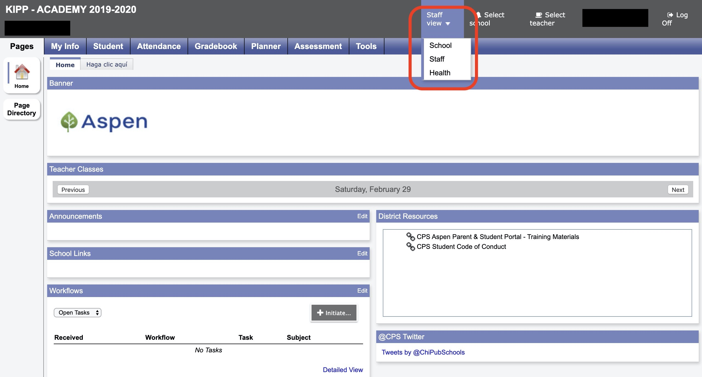
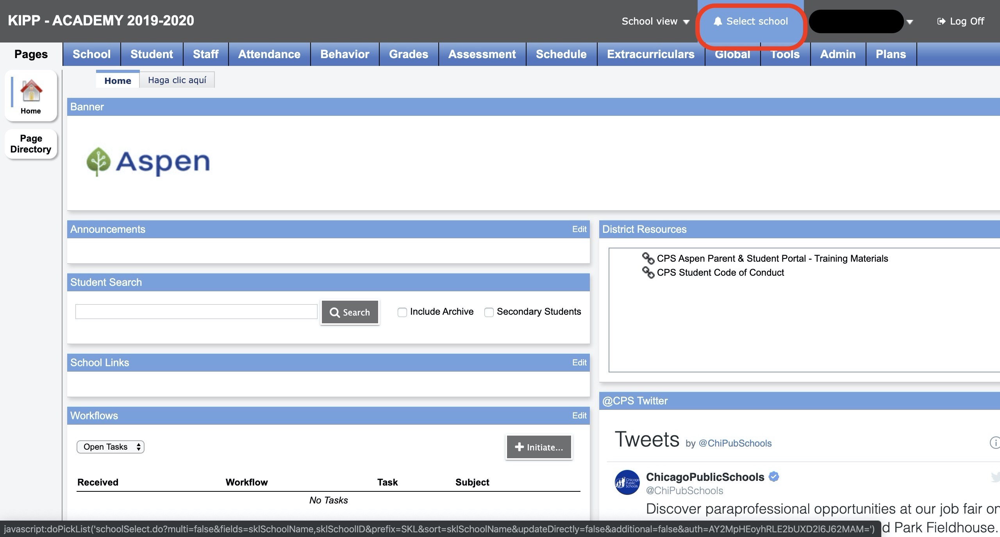
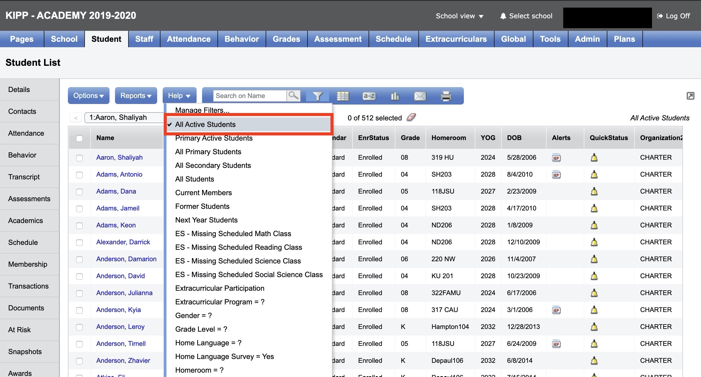
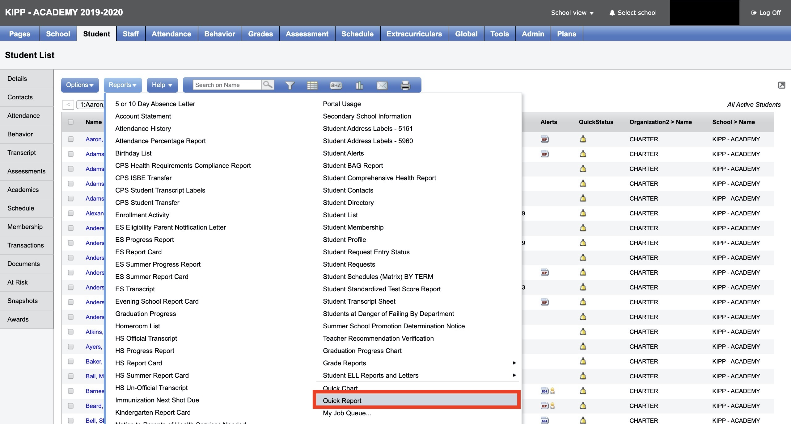
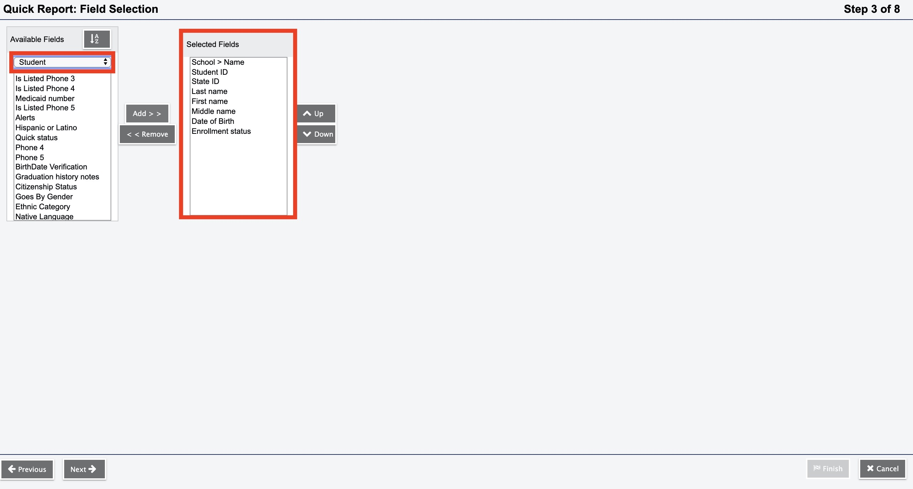
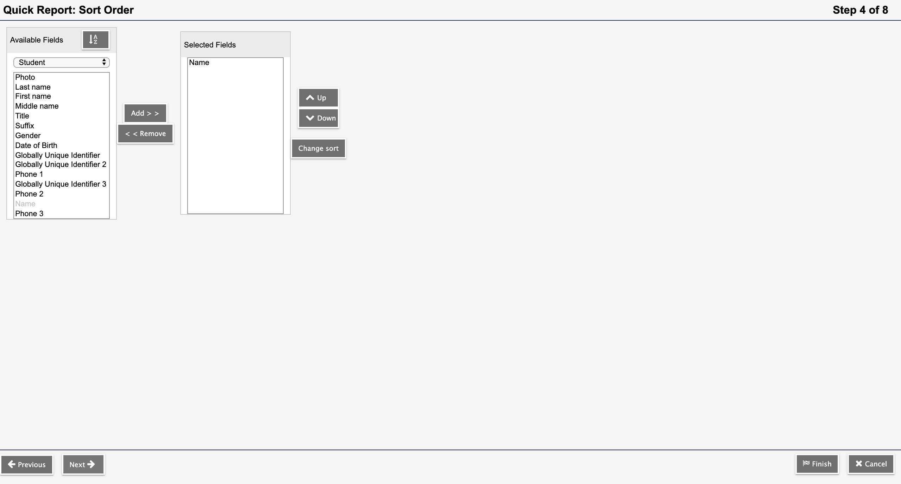
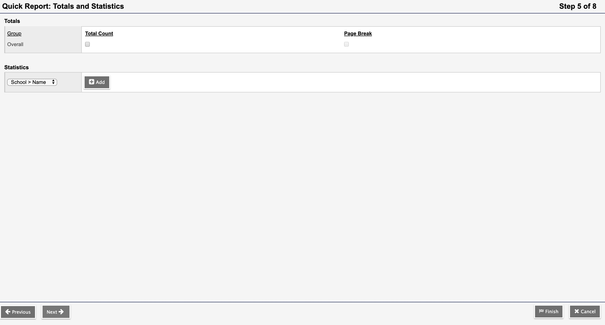
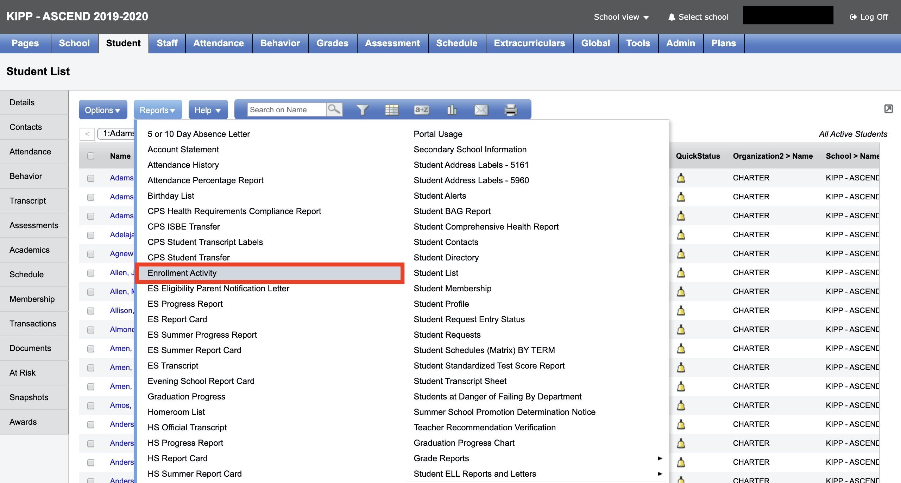
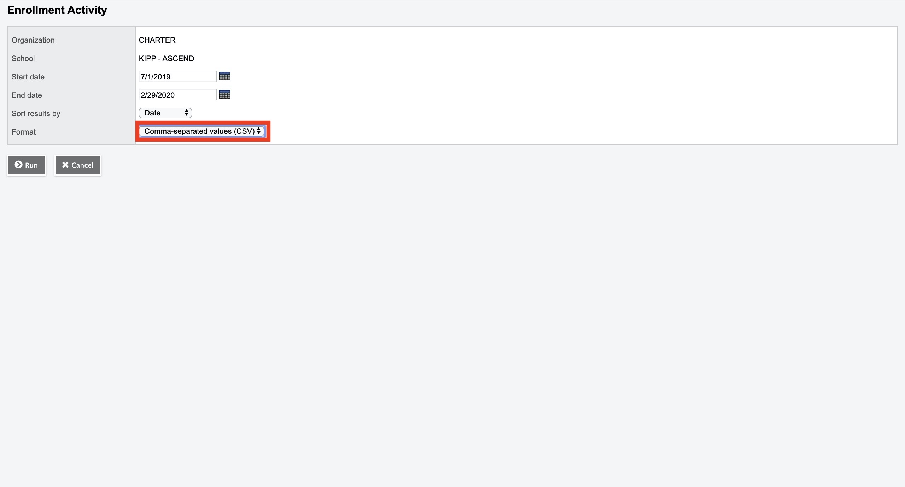

# 1. Introduction
In Illinois, at the at the end of every semester, each school is required to submit a set of data to the Office of I&I for transmission to the Illinois State Board of Education (ISBE). The state then uses this data to produce the annual State School Report Cards. The purpose of this project is to collect student and teacher data from KIPP Chicago's different data systems and put them in a format that conforms to ISBE's reporting requirements.

# 2. How to prepare for the midyear report 

1) Read instructions from CPS re ISBE Midyear Report and attend webinar.
2) Read List of data sources and reach out to co-workers early to ask for their help (best to reach out two weeks before the data is needed).

# 3. Data Sources and How to Access them
## 3A. Google Big Query 
All data sources listed in the `01-bq_files.R` script are stored in KIPP Chicago's Big Query Database. In order to access these datasets you will need: 
1. The credentials to gain access to Google Cloud Platform

## 3B. Google Cloud Storage Files: 
All data sources listed in the `0s-gcs_files.R` script are collected from sources outside of KIPP Chicago's data warehouse. These sources include ASPEN SIS, Zenefits, etc. Below is a list of all files and where to find them. 

### I) Mapping of State Course IDs to Local Course IDs and Titles

**File Description**\
`course_local_number_state_ids.csv`\
This csv matches ISBE State Course Codes with the local course IDs and local course titles for all KIPP Chicago classes. 

**File Location**\
This file was created manually. As schools add or drop classes (or change course names), this file will need to be manually updated.  

### II) Zenefits Data (HR Data)
**File Description**\
`zenefits_teacher_data_isbe_midyear_reporting.csv`\
This csv contains HR information for everyone working at KIPP Chicago. 

**File Location**\
This is a custom report created from Zenefits (KIPP Chicago's HR SIS system). This information can be pulled by either someone in HR or the Chief of staff. Remember to required that they include identifying information such as date of birth, work email address, serving location and employment dates. 

### III) Teacher IEIN Numbers and Birth Dates
**File Description**\
`19_20_IEIN_numbers.csv`\
This csv contains identifying information for teachers. Information includes name, date of birth, IEIN number and serving school. 

**File Location**\
This file can be collected from Head of talent, COO or HR. Note, ask HR if they have an existing report first before putting in a request to talent. teacherid column matches the information in the cc table and will need to be input by hand. 

Note: The users table will need to be connected to the schoolstaff table in order to find the correct teacherid for each teacher. The teacherid colum is the id column in the schoolstaff table (users and schoolstaff tables are located on big query).

> users.user_dcid = schoolstaff.user_dcid
> THEN
> schoolstaff.id = cc.teacherid

### IV) List of Start Dates for teachers hired after the first day of school
**File Description**\
`kipp_staff_member_start_after_20190819.csv`\
Some teachers start after the first day of school. In order to provide the correct start date for those teachers we need a file that lists the start dates for every teacher who started after the first day of school. 

**File Location**\
This file can be collected from HR. 

### V) Datasets of all Students in KIPP Chicago from ASPEN

**File Description**\
Ex. `400044_ascend_current_students_aspen.csv`\
Ex. `400044_ascend_former_students_aspen.csv`\
These files contain the legal name, date of birth, State and CPS ID and School for all KIPP Chicago Students. This includes both current students and transferred students (Note: our report includes students who have transfered within the year). 

**File Location**\
These files (8 in total) are downloaded from [ASPEN](https://aspen.cps.edu/aspen/logon.do). In order to log into ASPEN you will need your cps username and password (the same credentials that you use to log into your CPS email address). Below is a step-by-step guide for finding this information in ASPEN. 

------

#### 1. Log into [ASPEN](https://aspen.cps.edu/aspen/logon.do) then navigate to the view tab and select school view.

\newpage

#### 2. Select a School

#### 3. Select the filter icon and choose either "All Active Students" or "Former Students". **NOTE:** You cannot pull all students at the same time and will need to go through the following steps for both filters for all 4 schools.

\newpage

#### 4. Click on the "Report" tab and select "Quick Report" in the dropdown menue.

#### 5. Select "New Report" and click "Next then select "Simple" and click Next.

#### 6. Ensure that "Student" is selected in the dropdown then add all variables included in "Selected Fields" box below. Afterwards click next.

\newpage

#### 7. The next screen shows an almost identical display. No need to add variables to the "Selected Fields" box. Click next. 

#### 8. Select comma-seperated-values from the dropdown menue. Afterwards select "Finish" This will open up a new page with all info requested information. You can then copy and paste this information into a CSV and seperate the column on commaas.

------

### VI) List of Students with Conflicting CPS Student IDs in Between ASPEN and Powerschools

**File Description**\
`cps_id_corrections.csv`\
List of students with differing IDs in ASPEN and Powerschool. For reporting purposes we need to use the CPS ID listed in powerschool for each student, but in order to join data we used the IDs listed in Powerschools.

**File Location**\
This file was created by doing an anti_join in R between the [cpsschoolid]_[schoolname]_current/former_students_aspen.csv and students table (join on CPS Student ID). Output shows students in ASPEN with no match Powerschool. Next step is to take this look and search for each student in PowerSchools by hand and note the CPS Student ID used in PowerSchool

### VII) List of all Students Enrolled in KIPP Chicago in ASPEN
**File Description**\
Ex. `enrollment_academy_aspen_400146.csv`\
This file lists enrollment information for KIPP Chicago Students. If a student starts school after the first day of classes KIPP Chicago's enrollment records (the records kept in powerschool) are often different from the official ASPEN records. The report needs to list the enrollment date from ASPEN 

**File Location**\
The file is located in ASPEN. [ASPEN](https://aspen.cps.edu/aspen/logon.do). In order to log into ASPEN you will need your cps username and password (the same credentials that you use to log into your CPS email address). Below is a step-by-step guide for finding this information in ASPEN. 

------

#### 1. Within the "School View" under the "Students" tab click the report button and select "Enrollment Activity 

#### 2. In the menu select "comma-seperated-values" then click "Run". This will produce a csv file to be downloaded to your device. 

------

### VIII) Name Corrections 
**File Description**\
`cps_name_replacement_aspen.csv`\
List of names that were still incorrect in Powerschool system the day before the submission was due. Becuase we are using names from ASPEN we should not need this. Note: This file will not be needed next year.

# 4. Initial Report Generation
1. Ensure that you have the `ProjectTemplate` package installed in R.
1. Ensure that you have All required R Packages (check the `config/global.dcf`
file for all required libraries).
1. Ensure that you have required permissions for KIPP Chicago Google Cloud Platform
account (Big Query and Google Cloud Storage used for this project).
1. Navigate to the `src` folder and run `01-A_write_submission_files.R` file.
This will produce the report files in the required format for ISBE and write them
to the `output\final_reports` folder. Note: if you'd like to see the final Files
in R look at the `isbe_midyear_report_400146`, `isbe_midyear_report_400044`,
`isbe_midyear_report_400163`, and `isbe_midyear_report_400180` dataframes.

# 5. Error Handling
1. After you receive your first error report from CPS navigate to the `src`
folder and run the `02-A_evaluate_cps_validation_period_errors.Rmd` file. This file
will produce dataframes that show all unique errors by school. This file
will also produce dataframes that list all unique name errors and date of birth
errors.
1. Use the `03-A_produce_write_submission_files_with_error_fixes.R` file to fix problems with the final reports that cannot be corrected in original code (use this
file cautiously).

# 6. Common Pitfalls
1. If the data validation process is conducted in google drive do not erase the original file. Instead, copy and paste the data into the files provided. 

# 7. Useful Links

* https://www.isbe.net/Pages/Illinois-State-Course-System.aspx
* https://www.isbe.net/Pages/SIS-Data-Elements-approved-codes-and-indicators.aspx

